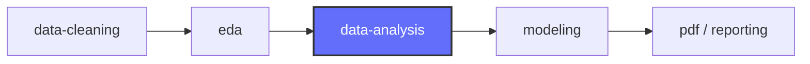

# 🔬 Referencia Técnica Avanzada — Data Analysis

> Funciones helper, patrones avanzados y guía de selección de visualizaciones para análisis cuantitativo del dataset bancario.

---

## 1. Funciones Helper Reutilizables

### Perfil estadístico completo de una columna
```python
from scipy import stats as sp_stats

def perfil_columna(df, col):
    """Genera un perfil estadístico completo de una columna numérica."""
    s = df[col].dropna()
    stat, p_norm = sp_stats.normaltest(s)

    perfil = {
        "columna": col,
        "n": len(s),
        "nulos": df[col].isnull().sum(),
        "media": s.mean(),
        "mediana": s.median(),
        "moda": s.mode().iloc[0] if not s.mode().empty else None,
        "std": s.std(),
        "cv": (s.std() / s.mean() * 100) if s.mean() != 0 else None,
        "min": s.min(),
        "q1": s.quantile(0.25),
        "q3": s.quantile(0.75),
        "max": s.max(),
        "iqr": s.quantile(0.75) - s.quantile(0.25),
        "asimetria": s.skew(),
        "curtosis": s.kurtosis(),
        "es_normal": p_norm > 0.05,
        "p_normalidad": p_norm
    }
    return perfil
```

### Análisis de conversión multi-dimensional
```python
def conversion_multidim(df, col1, col2, target="subscribed", valor_positivo="yes"):
    """Calcula tasas de conversión cruzando dos variables categóricas."""
    tabla = df.groupby([col1, col2])[target].agg(
        total="count",
        positivos=lambda x: (x == valor_positivo).sum()
    ).reset_index()
    tabla["tasa"] = (tabla["positivos"] / tabla["total"] * 100).round(2)

    # Pivot para visualización
    pivot = tabla.pivot(index=col1, columns=col2, values="tasa")
    return tabla, pivot
```

### Detección automática de outliers
```python
import numpy as np

def detectar_outliers(df, columnas, metodo="iqr", k=1.5):
    """Detecta outliers por IQR o Z-score en múltiples columnas."""
    resultados = {}
    for col in columnas:
        s = df[col].dropna()
        if metodo == "iqr":
            Q1, Q3 = s.quantile(0.25), s.quantile(0.75)
            IQR = Q3 - Q1
            mask = (s < Q1 - k * IQR) | (s > Q3 + k * IQR)
        elif metodo == "zscore":
            z = np.abs((s - s.mean()) / s.std())
            mask = z > k
        else:
            raise ValueError(f"Método no soportado: {metodo}")

        resultados[col] = {
            "n_outliers": mask.sum(),
            "pct_outliers": (mask.mean() * 100).round(2),
            "rango_sin_outliers": (s[~mask].min(), s[~mask].max())
        }
    return pd.DataFrame(resultados).T
```

### Generador de resumen ejecutivo automático
```python
def resumen_ejecutivo(df, target="subscribed", valor_positivo="yes"):
    """Genera un resumen ejecutivo automático del dataset."""
    n = len(df)
    tasa = (df[target] == valor_positivo).mean() * 100

    print(f"{'='*60}")
    print(f"  RESUMEN EJECUTIVO")
    print(f"{'='*60}")
    print(f"📊 Registros: {n:,}")
    print(f"📊 Variables: {df.shape[1]}")
    print(f"📊 Tasa de conversión: {tasa:.2f}%")
    print(f"📊 Ratio desbalance: 1:{int((100-tasa)/tasa)}")
    print(f"\n--- Variables numéricas ---")
    for col in df.select_dtypes(include=[np.number]).columns:
        print(f"  {col}: μ={df[col].mean():.2f}, σ={df[col].std():.2f}")
    print(f"\n--- Variables categóricas ---")
    for col in df.select_dtypes(include=["object", "category"]).columns:
        n_unique = df[col].nunique()
        top = df[col].value_counts().index[0]
        print(f"  {col}: {n_unique} categorías (moda: {top})")
```

---

## 2. Patrones Avanzados de Análisis

### Análisis de cohortes por mes de contacto
```python
def analisis_cohorte(df, col_cohorte="contact_month", target="subscribed"):
    """Analiza métricas de campaña agrupadas por cohorte temporal."""
    cohortes = df.groupby(col_cohorte).agg(
        n_contactos=(target, "count"),
        conversiones=(target, lambda x: (x == "yes").sum()),
        duracion_media=("call_duration", "mean"),
        intentos_media=("contact_attempts", "mean")
    )
    cohortes["tasa_conversion"] = (cohortes["conversiones"] / cohortes["n_contactos"] * 100).round(2)
    cohortes["eficiencia"] = (cohortes["conversiones"] / cohortes["intentos_media"]).round(2)
    return cohortes
```

### Análisis RFM adaptado (Recency, Frequency, Monetary → Resultado)
```python
def analisis_rfm_campaña(df):
    """Análisis RFM adaptado para campaña bancaria.
    R = previously_contacted (recency de contacto anterior)
    F = contact_attempts (frecuencia de contacto actual)
    M = call_duration (duración/intensidad de la interacción)
    """
    rfm = df[["previously_contacted", "contact_attempts", "call_duration", "subscribed"]].copy()
    rfm.columns = ["recency", "frequency", "monetary", "subscribed"]

    # Excluir no contactados previamente (999)
    rfm_filtrado = rfm[rfm["recency"] != 999].copy()

    # Cuartiles
    for col in ["recency", "frequency", "monetary"]:
        rfm_filtrado[f"{col}_q"] = pd.qcut(rfm_filtrado[col], 4, labels=[1,2,3,4], duplicates="drop")

    # Tasa de conversión por combinación RFM
    rfm_grouped = rfm_filtrado.groupby(["recency_q", "frequency_q", "monetary_q"]).agg(
        n=("subscribed", "count"),
        conversiones=("subscribed", lambda x: (x == "yes").sum())
    ).reset_index()
    rfm_grouped["tasa"] = (rfm_grouped["conversiones"] / rfm_grouped["n"] * 100).round(2)

    return rfm_grouped.sort_values("tasa", ascending=False)
```

### Test de significancia estadística entre grupos
```python
from scipy.stats import chi2_contingency, mannwhitneyu

def test_significancia(df, col, target="subscribed"):
    """Aplica el test estadístico apropiado según tipo de variable."""
    if df[col].dtype in ["object", "category"]:
        # Chi-cuadrado para categóricas
        tabla = pd.crosstab(df[col], df[target])
        chi2, p, dof, expected = chi2_contingency(tabla)
        return {"test": "chi2", "estadístico": chi2, "p_value": p, "significativo": p < 0.05}
    else:
        # Mann-Whitney U para numéricas (no asume normalidad)
        grupo_yes = df[df[target] == "yes"][col].dropna()
        grupo_no = df[df[target] == "no"][col].dropna()
        stat, p = mannwhitneyu(grupo_yes, grupo_no, alternative="two-sided")
        return {"test": "mann_whitney", "estadístico": stat, "p_value": p, "significativo": p < 0.05}
```

---

## 3. Guía de Selección de Visualizaciones

| Pregunta de análisis | Tipo de gráfico | Función Plotly |
|:---------------------|:----------------|:---------------|
| ¿Cómo se distribuye una variable? | Histograma + boxplot | `px.histogram(marginal="box")` |
| ¿Hay diferencias entre grupos? | Boxplot / Violin | `px.box()` / `px.violin()` |
| ¿Cuál es la proporción de clases? | Pie / Donut | `px.pie(hole=0.4)` |
| ¿Qué tan correlacionadas están? | Heatmap | `ff.create_annotated_heatmap()` |
| ¿Cómo evoluciona en el tiempo? | Línea con marcadores | `go.Scatter(mode="lines+markers")` |
| ¿Qué segmento convierte más? | Barras horizontales | `go.Bar(orientation="h")` |
| ¿Interacción entre 2 categóricas? | Heatmap cruzado | `ff.create_annotated_heatmap()` |
| ¿Distribución del target por grupo? | Barras apiladas | `px.bar(barmode="stack")` |
| ¿Outliers por variable? | Boxplot múltiple | `px.box()` con facetas |

### Paleta de colores del proyecto
```python
# Colores consistentes con el skill eda
COLORES_PROYECTO = {
    "primario": "#636EFA",      # Azul Plotly
    "secundario": "#EF553B",    # Rojo Plotly
    "exito": "#00CC96",         # Verde
    "advertencia": "#FFA15A",   # Naranja
    "info": "#19D3F3",          # Cyan
    "fondo": "white",
    "escala_divergente": "RdBu_r",
    "escala_secuencial": "YlGn",
    "escala_conversion": "RdYlGn",
    "par_target": ["#EF553B", "#00CC96"]  # [no, yes]
}
```

---

## 4. Integración con el Pipeline del TFM



### Entradas esperadas
- Dataset limpio (salida de `data-cleaning`)
- Conocimiento visual de distribuciones (salida de `eda`)

### Salidas generadas
- Insights cuantificados para el informe
- Segmentos identificados para feature engineering
- Variables macro influyentes para modelado
- Informe estructurado en `informes/`
